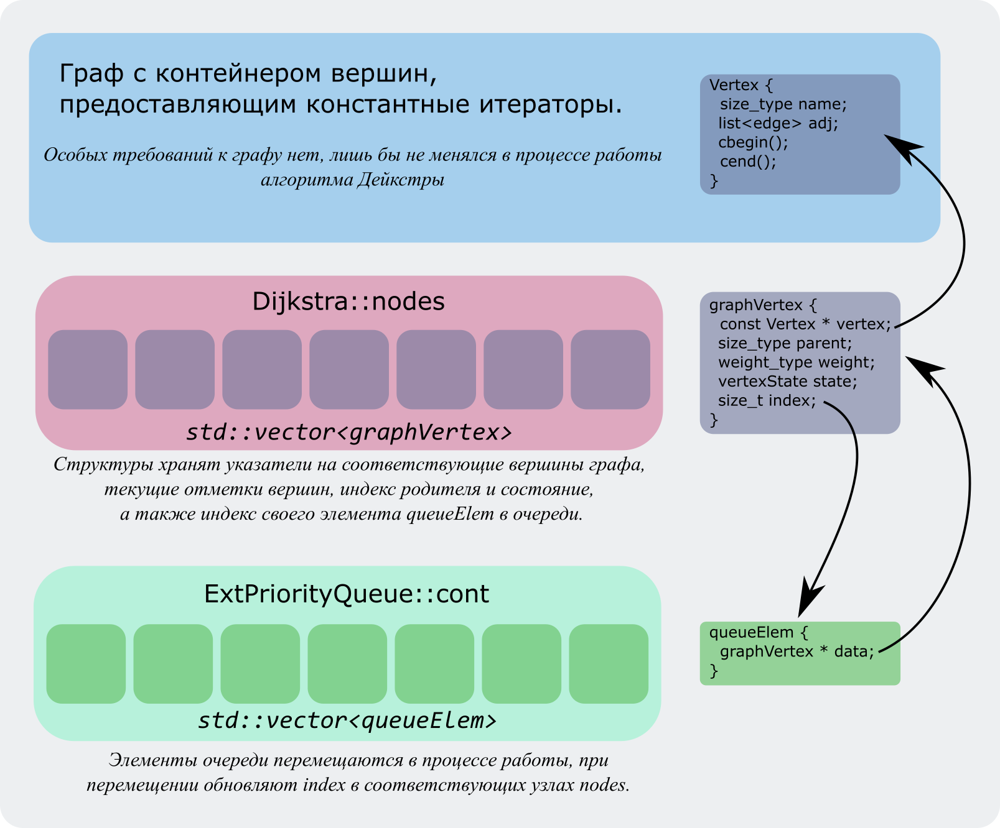

# Dijkstra
Алгоритм Дейкстры нахождения кратчайшего пути между парой вершин (в этом варианте не ищутся все кратчайшие пути из начальной вершины во все остальные). В качестве базовой структуры используется очередь с приоритетами на основе двоичной куче, с реализованной функцией DecreaseKey.
Требования к графу указаны в начале файла Dijkstra.h, общая схема примерно такая:

